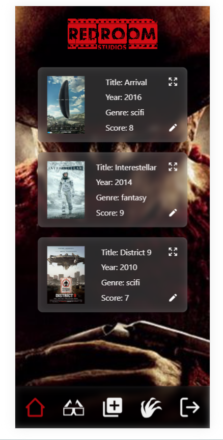

# Movie Hub Mobile Version 🍿





## Table of Content:

- [About](#about)
- [Technologies](#technologies)
- [Setup](#setup)

## About

This application is a light movie hub to save and track your most loved movies.


## Technologies
- NextJs
- React-icons
- React-hook-form
- Node.js
- Express.js
- PostgreSQL
- Prisma
- Cloudinary
- Auth0


## Setup
```
git clone https://github.com/luisjover/moviehub_next

git clone https://github.com/luisjover/movie-hub
```

```
cd server
```

```
npm install
```
- Create an account at Auth0 and Cloudinary
- Get the credentials as you can see in the .env.example files
- Create your own .env file 
- Get referenced by the provided .env.example file

```
npm run dev in both repos
```

## Enjoy the power of CINEMA! 🍿
